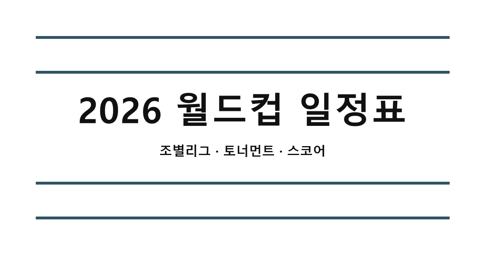

# 2026 월드컵 일정표

2026 월드컵 104경기의 일정과 최종 결과를 인쇄물형 표와 토너먼트 대진으로 보여 주는 React 웹 앱입니다.

**대회 종료 아카이브** — 2026년 7월 20일 기준으로 모든 경기 결과가 반영되어 있으며 자동 갱신은 종료되었습니다.

[사이트 보기](https://parktj4264.github.io/world-cup-schedule-ui/)



## 주요 기능

- 조별리그부터 결승까지 104경기 일정과 최종 스코어 제공
- 전체 일정, 조별리그, 32강부터 결승까지 워크북형 탭 구성
- 토너먼트 대진과 승자 자동 전파
- 경기별 득점자, 승부차기 등 상세 정보 모달
- 우승팀 요약과 최초 1회 종료 기념 효과
- 골든볼·골든부트·골든글러브·영플레이어 수상자 사진과 크레딧
- 모바일과 데스크톱에 대응하는 포스터형 UI
- 공유 링크, PWA 아이콘, Open Graph 미리보기 지원

## 기술 구성

- React 19
- TypeScript
- Vite
- Tailwind CSS
- GitHub Actions / GitHub Pages

## 로컬 실행

Node.js 22 이상을 권장합니다.

```bash
npm ci
npm run dev
```

프로덕션 빌드는 다음 명령으로 확인할 수 있습니다.

```bash
npm run build
npm run preview
```

## 데이터 구조

기본 일정은 [`src/data/schedule.ts`](./src/data/schedule.ts)에 있고, 최종 경기 결과 스냅샷은 [`public/data/live-schedule.json`](./public/data/live-schedule.json)에 있습니다. 앱은 시작할 때 두 데이터를 병합해 최종 화면을 구성합니다.

- `game(date, time, group, round, home, away, homeFlag, awayFlag)` 형식으로 경기 추가
- 하루는 `cells` 배열로 구성
- 빈 칸은 생략해도 화면에서 네 칸까지 자동 보정
- 한 칸에 두 경기를 넣으려면 `cell(game(...), game(...))` 형태로 작성

## 자동 갱신 재사용

대회가 끝난 현재 배포는 아카이브 모드가 기본값입니다. 정기 GitHub Actions 실행과 방문자 브라우저의 외부 API 조회는 꺼져 있지만 관련 구현은 다음 프로젝트에서 재사용할 수 있도록 남겨 두었습니다.

브라우저 갱신 모드를 다시 활성화하려면 빌드 환경에 다음 값을 설정합니다.

```text
VITE_LIVE_UPDATES_ENABLED=true
```

수동 데이터 갱신과 재배포는 GitHub Actions의 `Update live schedule` 워크플로에서 `Run workflow`로 실행할 수 있습니다. 기본 제공자는 `worldcup26.ir`이며, `LIVE_SCHEDULE_PROVIDER=api-football`과 `API_FOOTBALL_KEY`를 설정하면 API-FOOTBALL도 후보 제공자로 사용할 수 있습니다. 제공자 실패 시 기존 최종 데이터가 보존됩니다.

## 배포

`main` 브랜치에 변경사항이 푸시되면 정적 스냅샷을 사용해 GitHub Pages로 배포됩니다. Pull Request와 `feature/**` 브랜치에서는 별도의 빌드 검증이 실행됩니다.

## 데이터와 에셋 출처

- 경기 데이터: [worldcup26.ir](https://worldcup26.ir/), 선택적 [API-FOOTBALL](https://www.api-football.com/), 폴백 일정 [openfootball/worldcup.json](https://github.com/openfootball/worldcup.json)
- 개인상 결과: [FIFPRO](https://www.fifpro.org/en/articles/2026/07/players-recognised-with-individual-awards-at-the-2026-world-cup), [AP](https://apnews.com/article/fccc26aa12d9226e63d06b601b770617)
- 수상자 사진: Wikimedia Commons / Bryan Berlin / CC BY-SA 4.0 — [Rodri](https://commons.wikimedia.org/wiki/File:Rodri_France_v_Spain_7.24.26-260.jpg), [Kylian Mbappé](https://commons.wikimedia.org/wiki/File:Kylian_Mbappe_France_v_Senegal_16_June_2026-391_(cropped).jpg), [Unai Simón](https://commons.wikimedia.org/wiki/File:Unai_Simon_France_v_Spain_7.24.26-118_(cropped).jpg), [Pau Cubarsí](https://commons.wikimedia.org/wiki/File:Pau_Cubarsi_France_v_Spain_7.24.26-155.jpg)
- 국기 SVG: [lipis/flag-icons](https://github.com/lipis/flag-icons), MIT License

이 프로젝트는 비공식 팬 프로젝트이며 FIFA 또는 대회 주최 기관과 관련이 없습니다.

## 라이선스

프로젝트 코드는 [MIT License](./LICENSE)로 배포됩니다. 외부 데이터와 에셋에는 각 제공자의 약관 및 라이선스가 적용됩니다.
